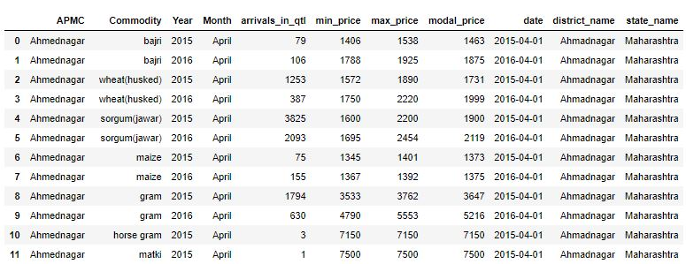
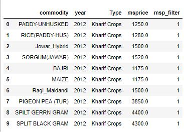
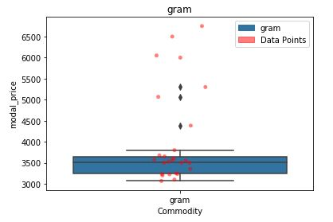
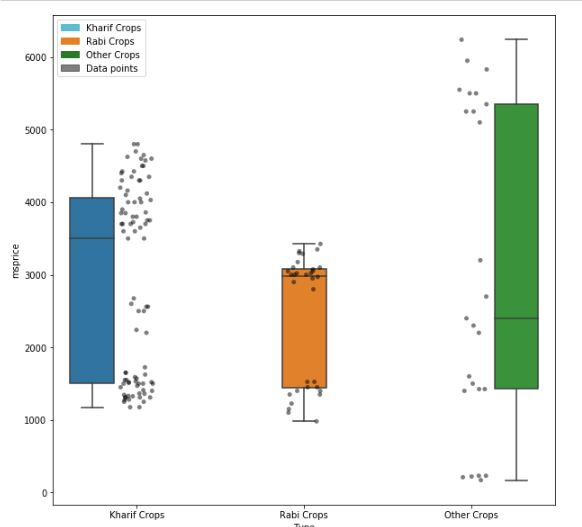
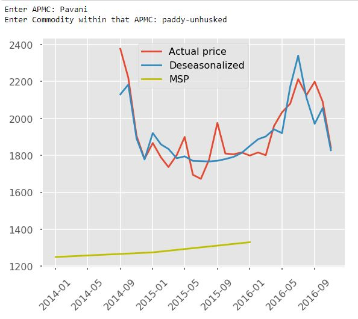
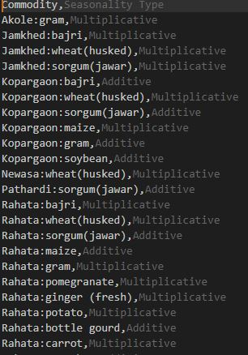
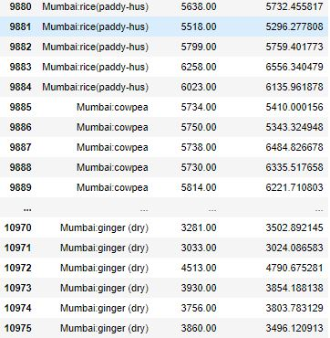
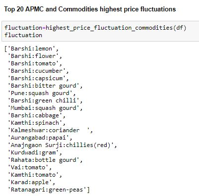

# Time Series Analysis on agricultural commodity prices
This project aims to analyze trends and seasonality in datasets consisting of commodity prices for different APMCs of Maharashtra.
Don't forget to star this repository if it helped you in any way. Thanks!

#### Project Status: [Completed]

## Project Intro/Objective

The purpose of this project is identify relevant seasons of different agricultural commodities. It furthermore analyzes price fluctuations and flags the ones with most fluctuation in relevant months of the season. 

### Through this project, I've tackled the following tasks:

> **1.	Testing and filtering outliers from the data.**

> **2. 	Understanding price fluctuations accounting the seasonal effect**

> * **1.	Detecting seasonality type (multiplicative or additive) for each cluster of APMC and commodities**

> * **2.	De-seasonalising prices for each commodity and APMC according to the detected seasonality type**

> **3.	Comparing prices in APMC with MSP(Minimum Support Price)- raw and deseasonalised**

> **4.	Flagging set of APMC and commodities with highest price fluctuation across different commodities in each relevant season, and year.**

### Skills portrayed through this project

* Time-series Analysis
* Data Crunching 
* Inferential Applied Statistics
* Outlier Detection through Inter-quartile ranges
* Statistical Decomposition of Time-series data
* Data Visualization

### Technologies/Libraries Used
* Statsmodels
* Python
* Matplotlib, Seaborn
* Pandas, Numpy

## Getting Started

1. Clone this repository (for help see this [tutorial](https://help.github.com/articles/cloning-a-repository/)).
2. Raw Data is being kept [Raw Data](Repo folder containing raw data) within this repository.
3. Data processing/transformation scripts are :  
* Task-1 Outlier Detection
* Task-2 (pre-processing)
4. Analysis is carried out in files names:
* Task 2 Accounting Seasonality
* Task 3 Comparing prices
* Task 4 Flagset highest price Fluctuation 

5. Running the files in that order will do the trick.

#### Author:

|Name     |  Slack Handle   | 
|---------|-----------------|
|[Vipul Rustagi](https://github.com/vipul115)| [LinkedIn](https://www.linkedin.com/in/vipul-rustagi-331290150/)  | 

## Screenshots

##### Raw Data

##### Outliers within a commodity

##### Overall outliers

##### Price comparisons

##### Seasonality of each cluster of region and commodity pairs

##### Deseasonalised prices of Area:commodity after seasonal decomposition

##### Pairs with high price fluctuations

## Contact
  
* vipulrustagi11@gmail.com
* Feel free to contact me for any questions or if you are interested in contributing!
